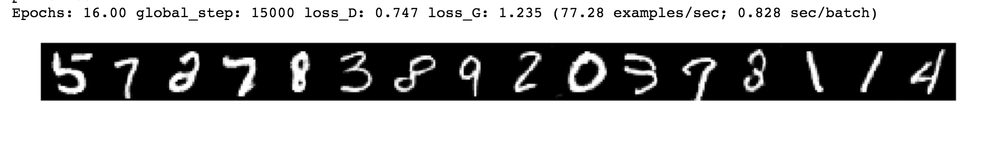

# dcgan-with-tf-iterator
Training Deep Convolutional Generative Adversarial Networks using tf.data.Iterator

MNIST images generated after 15000 global steps. 

But DCGAN generates random images other than what we want.  
Next time, I'll build a Conditional Generated Adversarial Networks that can produce the images we want. 
